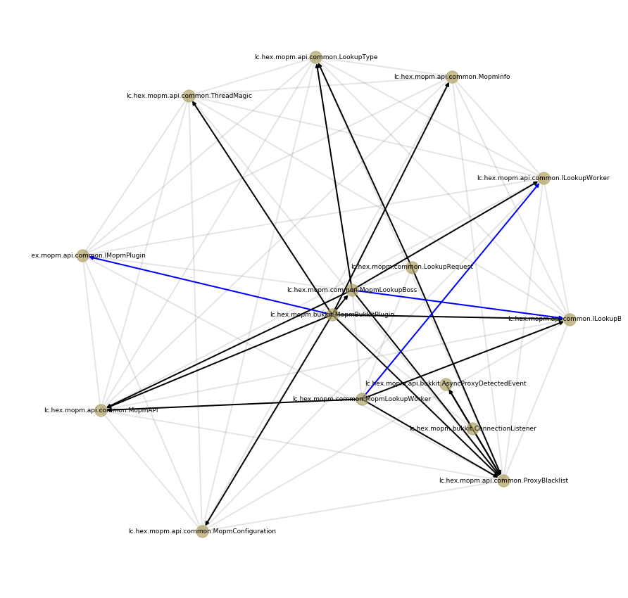

# Java Local Import Prediction with Gated Graph Neural Networks

- [Introduction](#introduction)
- [Getting the Data](#getting-the-data)
- [Data Preprocessing](#data-preprocessing-and-baselines)
- [Running the GGNNs](#running-the-ggnns)

## Introduction

This repository contains the code of my Senior Thesis in which I explore how
Gated Graph Neural Networks can be used to predict class-level imports in Java 
code. More specifically, I attempt to predict which classes (or, more properly, 
compilation units) defined in a certain project currently under development 
might be imported to a class newly defined in the same project given the new
class's name and possibly initial import statements in that class. 

Because the goal is to predict imports occurring within
a possibly unfinished project, one cannot gather enough import co-occurance 
statistics to efficiently predict class-level imports. Instead, one must rely
exclusively on information that is locally available. To approach this problem,
I propose to model relationships between compilation units in a project with a 
graph. A node in such a graph corresponds to a particular compilation unit. 
An edge between two nodes marks some relationship between the two corresponding 
compilation units. 

Below is an example of such a graph build for one of the repositories in my 
dataset. Grey undirected edges connect compilation units defined within the same 
package. Black directed units correspond to import statements. Blue edges mark 
class inheritance or interface implementation:

The code in this repository allows building such graphs for arbitrary GitHub
projects and running GGNNs on these graphs to learn to predict future imports in
a way similar to how [Allamanis *et al.*](https://arxiv.org/abs/1711.00740) 
solve the variable misuse task (they work on the level of a small piece of code
and model relationships between variables, while I model relationships between
files\compilation units in the context of a repository). The initial comparison 
between the baseline results I was able to achieve by other means 
(see notebooks/Baselines.ipynb) suggest that GGNNs are well suited for this task. For more details on the way I use GGNNs, see README.md in the python directory.

## Getting the Data

The data for this project can be obtained by running a set of SQL queries on 
publicly available BigQuery Dataset. The README.md file in the SQL directory
contains detailed information about replicating this step and the criteria 
used to select the data.

## Data Preprocessing and Baselines

The raw data can be downloaded from BigQuery via GCS as a set of .json files
each of which will contain millions of lines of Java code. This code can be 
parsed by running Parser.java (located in java/src) passing the name of one .json file as the first argument and the name of the output file as a second argument. You will need 
[JavaParser](https://javaparser.org/) to run this code. 

Next, the data goes through a series of preprocessing steps. To replicate them,
run Filtering.ipynb and ConvertingToGraphs.ipynb notebooks. You might need the
following python libraries to run this code: `pytorch, numpy, tqdm, joblib, 
networkx, sklearn, matplotlib, pandas`

More information on data preprocessing and baselines used for import prediction
can be found in the README.md file in the notebooks directory.

## Running the GGNNs

The detailed desription of the pytorch implementation of GGNNs used for this
project can be found in the README.md file in the python directory. The same
directory contains the python modules that define the network structure, the
loss function, and the way the data loader works. GGNNs.ipynb in the notebook
directory contains an example of how the newtork could be run.