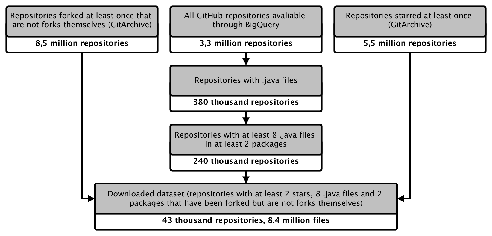

# Java Local Import Prediction with Gated Graph Neural Networks

## Getting the data from GitHub

To create the dataset for this project I used Google BigQuery in 
conjunction with [GH Archive](https://www.gharchive.org/). I downloaded all the java code from publicly licensed repositories that each contain at least 8 java files in at least two packages, that have been starred at least twice and forked at least once and that are not forks themselves. The reasons behind these criteria are explained below:

- Forks were removed to ensure that there are no duplicates in the dataset (further filtering was applied down the road to exclude duplicates that are not forks)
- The requirements for a repository to have at least one fork and two stars were used [here](https://homepages.inf.ed.ac.uk/csutton/publications/msr2013.pdf) and [here](https://arxiv.org/pdf/1904.03990.pdf) resp. to control for code quality. I decided to use both criteria to ensure that the code I download is of good quality.
- Since the goal of this project is two predict imports, it only makes sense to download repositories with at least 2 packages.
- The [number of possible different undirected graphs](http://oeis.org/A000088) of n nodes becomes larger than the number of GitHub repositories with n .java files at n=8, which is a threshold I have chosen to filter out repositories with too few files for which import prediction woudl make less sense.

Therefore, the data collection pipeline can be summarized in the picture below:

## How to run the SQL queries in this directory

All SQL queries in this directiry should be run in BigQuery. The descriptions of what each query does can be found in the comments. Also note that YOUR_PROJECT and YOUR_DATASET in these queries should be replaced with the title of the project and the dataset in use. The queries should be run in the following order:

- AllJavaRepos &rarr; save to `YOUR_PROJECT.YOUR_DATASET.repos_all`
- ListOfForks &rarr; save to `YOUR_PROJECT.YOUR_DATASET.forks`
- ListOfStars &rarr; save to `YOUR_PROJECT.YOUR_DATASET.stars`
- RelevantRepos &rarr; save to `YOUR_PROJECT.YOUR_DATASET.repos_relevant`
- RelevantFiles &rarr; save to `YOUR_PROJECT.YOUR_DATASET.files_relevant`
- RelevantContents &rarr; download locally
 